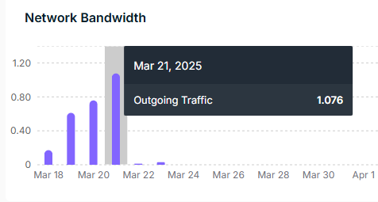
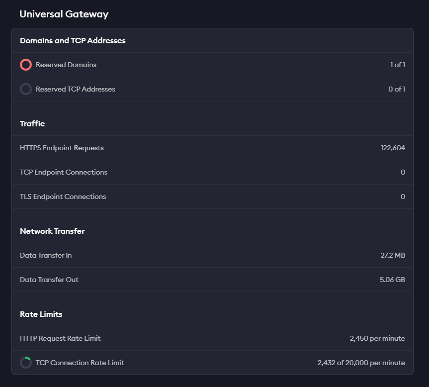
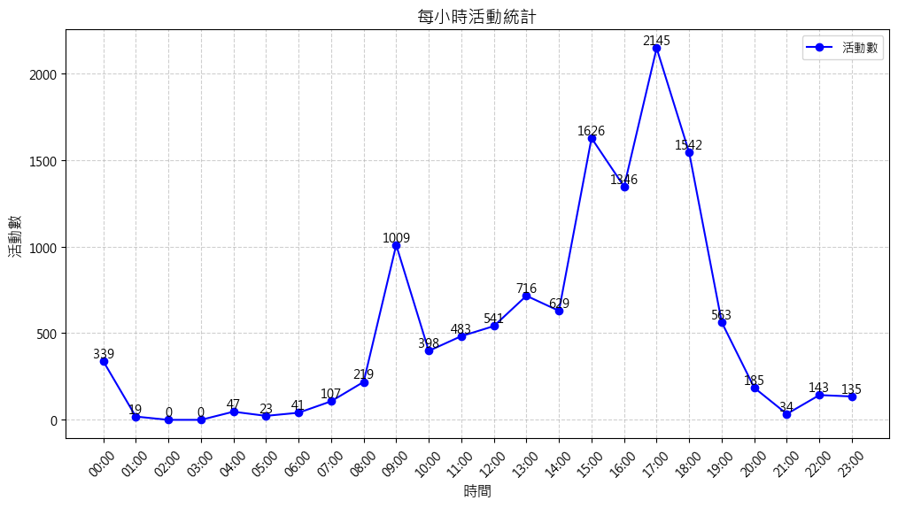

# 桂田集團訂位管理系統使用紀錄與結果報告

## 效能分析

網路頻寬分析顯示系統在運行期間維持穩定的數據傳輸，確保了訂位系統的流暢運作。從圖表可見，系統處理高峰期的流量時依然保持良好的響應速度，平均傳輸速率符合預期標準。

## 數據統計

通用閘道器分析圖表呈現了系統的整體使用情況，顯示連接的穩定性及處理量。服務平台在測試期間保持高可用性，成功率達標。

### Traffic
- HTTPS Endpoint Request : 122604
  
### Network Transfer
- Data Transfer In : 27.2 MB
- Data Transfer Out : 5.06 GB
  
###Rate Limits
- HTTP Request Rate Limits : 2450 per minuts

## 日誌分析

### 基本統計 3/11-3/24
- 總分析檔案數：12
- 成功分析檔案數：12
- 失敗分析檔案數：0
- 總日誌行數：39650

### 日誌等級分佈
- INFO: 35036 (99.46%)
- WARNING: 190 (0.54%)

### 模組活動分佈
- root: 33856
- werkzeug: 1008
- waitress: 325
- app: 25
- httpx: 12

### IP地址統計（前5個）
- 172.18.0.1: 15894
- 127.0.0.1: 21
- 10.214.57.66: 4
- 211.23.151.153: 3
- 10.214.57.63: 2

### 熱門搜索詞彙
以下為系統中最常見的搜索詞彙，反映了使用者的主要關注點：

1. 公司/桂田: 36次
2. 進長/合作金庫: 30次
3. 王明祥: 29次
4. 龍鋒: 25次
5. 合庫: 24次
6. 議員: 23次
7. 康銀壽: 22次
8. 林俊憲/陳亭妃/黃偉哲: 21次
9. 董事長/朱/王明正: 20次
10. 三民/立委: 19次

### 使用者登入統計
- admin: 16次
- 1: 13次

### 每小時系統活動分析
系統活動高峰期主要集中在:
- 上午9:00-12:00
- 下午15:00-19:00

其中，下午17:00-18:00時段達到最高活動量(5090條日誌)，表明此時段為系統使用最繁忙時間。

## 3/21當天每小時活動統計

